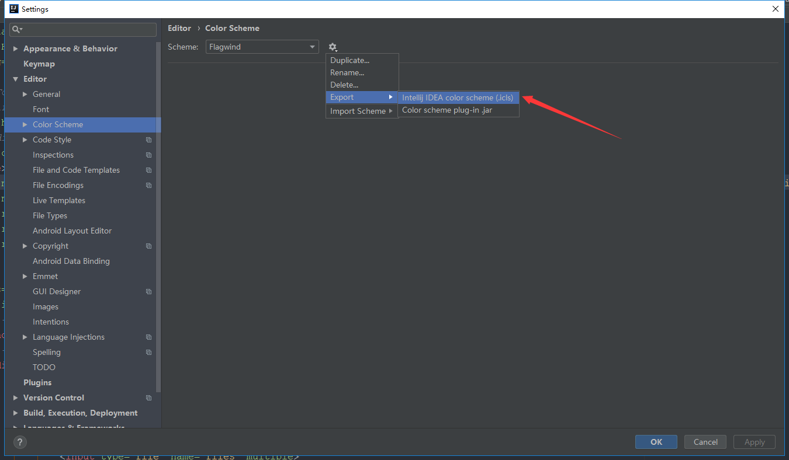
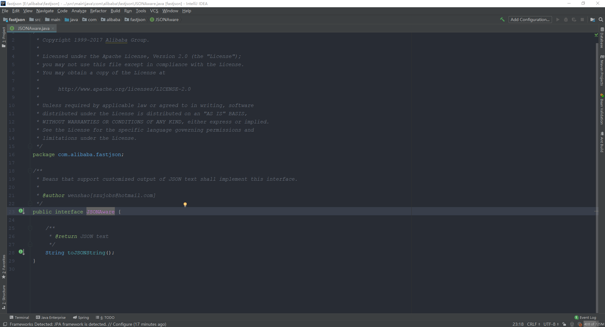
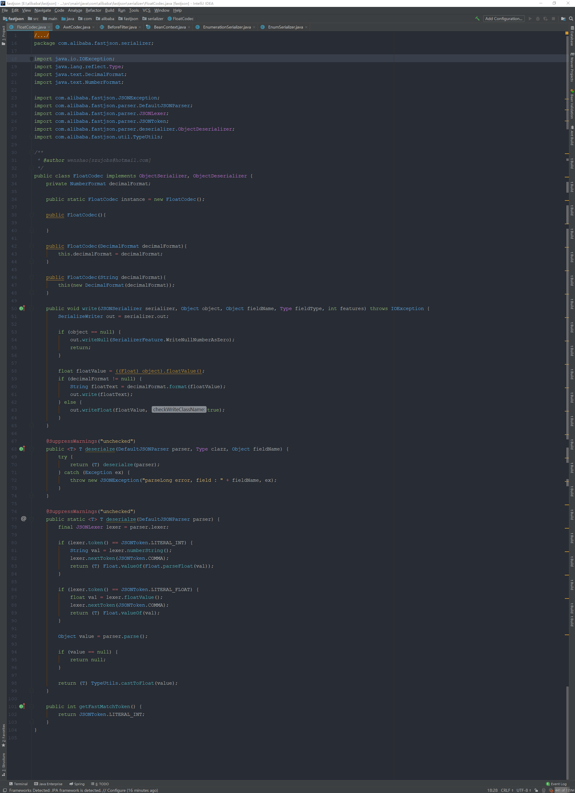
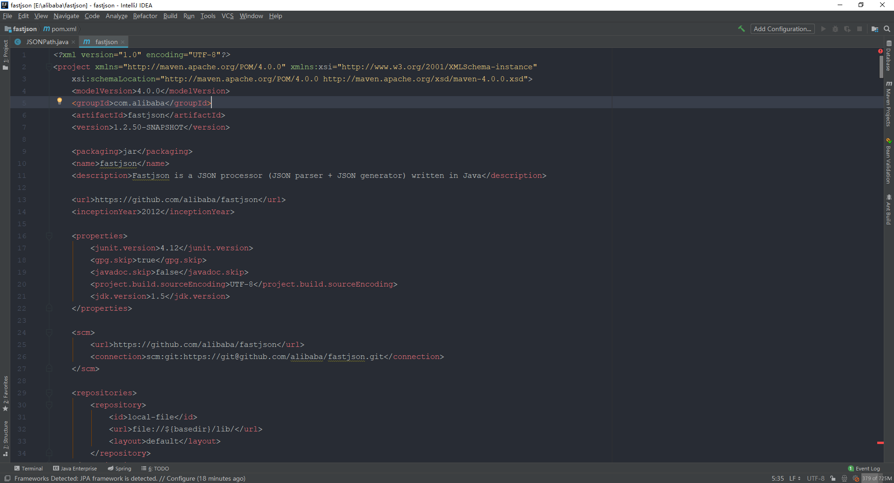
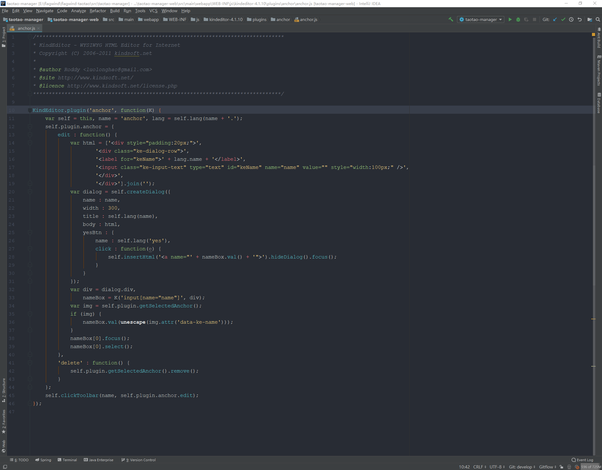
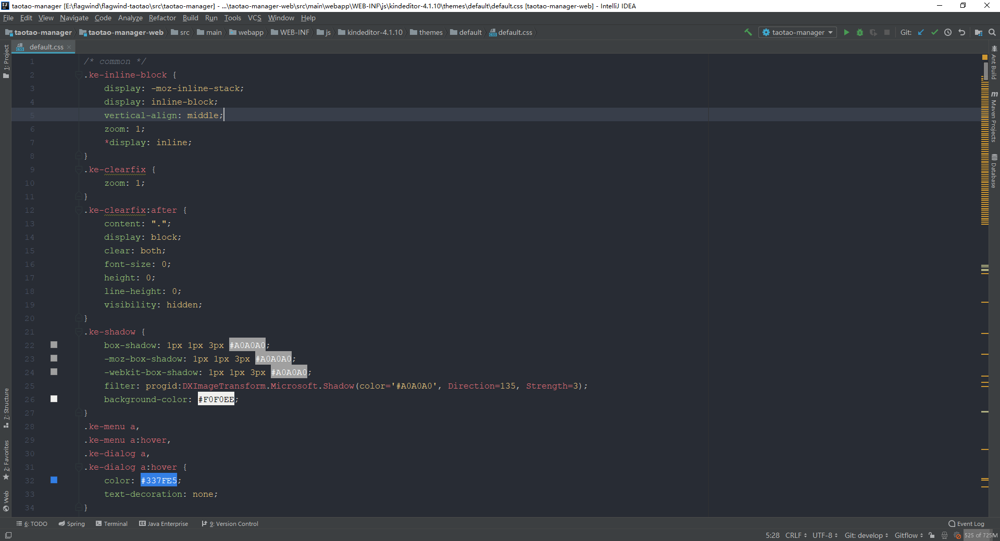

# IntelliJ IDEA 配色方案

## 如何导入？

下载 [flagwind.icls](./schemes/flagwind.icls) 按照如下路径导入。

> File -> Settings -> Editor -> Color Scheme -> Import Scheme

## 配色预览

### Interface

### Class

### XML

### HTML

### JavaScript

### CSS

